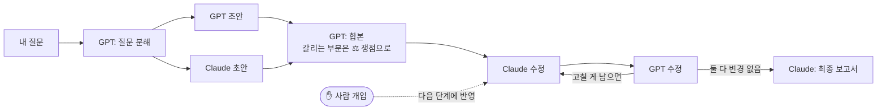

# 우리의장난감

**GPT(Codex)와 Claude(Claude Code) 두 AI가 함께 연구 문서를 쓰고 다듬는 로컬 앱**입니다.

두 모델이 각자 초안을 쓰면 하나로 합치고, 그 공동 문서를 번갈아 넘겨받아 근거와 함께 고칩니다. 둘 다 "더 고칠 게 없다"고 하거나 새 정보가 줄면 멈추고 최종 보고서를 만듭니다. 기존의 **토론 방식**(조사 → 상호비판 → 반박)도 선택할 수 있습니다.

> 모델 가중치를 학습시키는 강화학습(RL)은 아닙니다. 서로 다른 두 모델이 **초안을 합치고 번갈아 고치는 협업**을 반복해 결과물의 품질을 높이는 방식입니다.



### 주요 기능

- **공동 초안 협업**: 각자 초안 → 합본 → 번갈아 수정. 모든 버전과 "누가 무엇을 왜 고쳤는지"가 **공동 문서** 탭에 남습니다.
- **대화처럼 보기**: 내 질문, 모델별 말풍선, 핵심 요점 박스, 모델마다 걸린 시간 `(18m 26s)`를 실시간으로 표시합니다.
- **Markdown 입력**: 질문·참고 자료·후속 질문을 Markdown으로 쓰고 미리볼 수 있습니다. 모델 답변도 `핵심 요점` → 세부 구조로 받습니다.
- **UI에서 모델 선택**: 프로젝트마다, 후속 질문마다 GPT·Claude 모델과 추론 강도를 고릅니다.
- **중간 개입**: 연구가 도는 동안 메모를 보내면 다음 단계에 두 모델(또는 한쪽)에게 전달됩니다.
- **끊겨도 이어서**: 한도·로그인·서버 재시작으로 멈추면 **이어서 실행**으로 완료된 단계는 다시 호출하지 않고 멈춘 곳부터 계속합니다.
- **업데이트 알림**: GitHub에 새 버전이 올라오면 헤더에 버튼이 뜨고, 누르면 자동으로 받아서 재시작합니다.

- **API 키가 필요 없습니다.** 이미 쓰고 있는 ChatGPT 구독(Codex CLI)과 Claude 구독(Claude Code)의 로그인을 그대로 씁니다.
- Next.js, React, TypeScript와 로컬 JSON 저장소로 만들었습니다. 개인 컴퓨터 한 대에서 쓰는 앱입니다.

**목차**: [준비물](#1-준비물) · [설치](#2-설치) · [계정 연결](#3-계정-연결-로그인) · [실행](#4-처음-연구-실행하기) · [설정](#5-설정-envlocal) · [사용량](#6-사용량과-비용) · [문제 해결](#7-문제-해결) · [동작 방식](#동작-방식-자세히) · [기여하기](#기여하기)

---

## 1. 준비물

| 항목 | 설명 |
|---|---|
| Node.js 22 이상 | `node --version`으로 확인 |
| ChatGPT 구독 (Plus/Pro 등) | Codex CLI 로그인용 |
| Claude 구독 (Pro/Max 등) | Claude Code 로그인용 |
| Codex CLI | GPT 쪽 실행 |
| Claude Code | Claude 쪽 실행 |

화면과 흐름만 먼저 보고 싶다면 CLI나 구독 없이 **Mock 모드**로 실행할 수 있습니다([4단계](#4-처음-연구-실행하기) 참고).

## 2. 설치

```bash
git clone https://github.com/Sskskxi/our-toy.git
cd our-toy
npm ci
cp -n .env.example .env.local
```

### Codex CLI 설치

```bash
npm install -g @openai/codex
codex --version
```

### Claude Code 설치

```bash
curl -fsSL https://claude.ai/install.sh | bash
claude --version
```

`npm install -g @anthropic-ai/claude-code`로도 설치할 수 있습니다.

## 3. 계정 연결 (로그인)

앱은 아이디, 비밀번호, 토큰을 직접 받지 않습니다. **각 공식 CLI에 한 번 로그인해 두면** 앱이 그 로그인으로 CLI를 실행합니다. 로그인은 컴퓨터마다 한 번만 하면 됩니다.

### GPT 연결: Codex

```bash
codex login
```

1. 브라우저가 열리면 **Sign in with ChatGPT**를 선택합니다.
2. 구독 중인 ChatGPT 계정으로 로그인합니다.
3. 터미널에 로그인 성공 메시지가 나오면 끝입니다.

확인:

```bash
codex login status
```

> API 키 방식으로 로그인하지 마세요. 앱은 Codex를 `forced_login_method=chatgpt`로 실행하기 때문에 ChatGPT 계정 로그인만 사용합니다.

### Claude 연결: Claude Code

```bash
claude auth login
```

1. 브라우저가 열리면 **Claude 구독 계정(claude.ai)**으로 로그인합니다. Console(API) 계정 말고 구독 계정을 고르세요.
2. 권한을 승인하고 터미널로 돌아오면 끝입니다.

확인:

```bash
claude auth status
```

출력에 `"loggedIn": true`와 `"authMethod": "claude.ai"`가 있어야 합니다. 앱은 실행할 때마다 이 값을 검사하고, 조건이 맞지 않으면 `Claude 구독 로그인이 필요합니다` 오류를 냅니다.

### 계정 바꾸기 / 로그아웃

```bash
codex logout && codex login
claude auth logout && claude auth login
```

## 4. 처음 연구 실행하기

```bash
npm run dev
```

브라우저에서 **http://127.0.0.1:3000** 을 엽니다. `npm run dev`는 웹 화면과 연구 작업자(worker)를 함께 실행합니다. 끌 때는 터미널에서 `Ctrl+C`를 누릅니다.

1. **첫 화면 상단**에서 GPT와 Claude 구독의 남은 사용량을 확인합니다. `확인 불가`로 나오면 3단계 로그인을 다시 확인하세요.
2. **새 프로젝트**를 만들고 연구 주제를 입력합니다.
3. 실행 방식을 고릅니다.
   - **구독 · Codex + Claude Code**: 실제 연구입니다. 구독 사용량을 씁니다.
   - **Mock**: 합성 예시 데이터로 흐름만 보여줍니다. 실제 연구가 아닙니다.
4. **협업 방식**을 고릅니다. 기본값인 **공동 초안**을 권장합니다.
5. (구독 모드) **모델 선택**에서 GPT·Claude 모델과 추론 강도를 고릅니다. 비워 두면 `.env.local` 기본값을 씁니다.
6. **라운드 수**를 정합니다. 처음에는 **최소 1 / 최대 1**로 시험해 보세요.
7. (선택) 참고 텍스트를 붙여넣거나 TXT, MD, CSV, JSON, LOG 파일을 첨부합니다. 입력칸의 **미리보기**로 Markdown 모양을 확인할 수 있습니다.
8. 시작하면 **협업 과정** 탭에 모델별 말풍선과 경과 시간이 실시간으로 올라옵니다.

### 진행 중에 끼어들기

연구가 도는 동안 **협업 과정** 탭 아래의 **✋ 토론에 끼어들기**에 메모를 쓰고 **다음 단계에 반영**을 누르세요. 지금 진행 중인 모델 호출이 끝나고 다음 단계가 시작될 때 선택한 모델에게 전달되고, 타임라인에 "사람 개입"으로 표시됩니다. 방향 수정, 놓친 관점, 잘못된 전제 지적에 쓰면 좋습니다. 모델은 이 메모를 근거(출처)로 인용하지 않습니다.

### 결과 보기

| 탭 | 내용 |
|---|---|
| 협업 과정 | 내 질문, 핵심 요점 요약, 모델별 말풍선·경과 시간·변경 사항, 사람 개입 |
| 공동 문서 | 버전별 문서(v1 GPT 초안 … 최종), 차례마다 변경 사항과 남은 ⚖️ 쟁점 |
| 주장 / 근거 | 병합된 주장, 출처 URL, 반론 |
| 미해결 질문 | 다음 라운드로 넘어간 질문 |
| 보고서 | 최종 Markdown 보고서 |
| 참고 자료 | 첨부한 텍스트 |
| 대화 | 연구가 끝난 뒤 이어서 질문 |

**대화 탭**에서는 답할 모델을 고릅니다.

- `GPT만` / `Claude만`: 고른 모델이 한 번 답합니다.
- `GPT + Claude 둘 다`: 두 모델이 동시에 답하고 GPT가 두 답을 합쳐 정리합니다. 요청 한 번에 최대 3회 호출합니다.
- 중간에 실패하면 성공한 답은 남기고, `다시 시도`를 누르면 빠진 단계부터 이어갑니다.

Markdown 보고서와 전체 JSON 기록은 프로젝트 화면에서 내려받을 수 있습니다.

## 5. 설정 (`.env.local`)

```dotenv
RESEARCH_MODE=subscription
OPENAI_MODEL=gpt-5.6-sol
OPENAI_REASONING_EFFORT=high
ANTHROPIC_MODEL=claude-opus-5
ANTHROPIC_EFFORT=low
ENABLE_WEB_SEARCH=true
DATA_DIR=./data
PORT=3000
```

| 변수 | 의미 |
|---|---|
| `RESEARCH_MODE` | 기본 실행 방식 (`subscription` 또는 `mock`) |
| `OPENAI_MODEL` | Codex에서 쓸 모델 ID. 내 ChatGPT 계정에서 쓸 수 있는 모델이어야 합니다 |
| `OPENAI_REASONING_EFFORT` | GPT 추론 강도 (`low` / `medium` / `high` / `xhigh`) |
| `ANTHROPIC_MODEL` | Claude Code에서 쓸 모델 ID |
| `ANTHROPIC_EFFORT` | Claude 추론 강도 (`low` / `medium` / `high` / `xhigh` / `max`) |
| `ENABLE_WEB_SEARCH` | 조사·대화 단계에서 웹 검색을 쓸지 여부 |
| `DATA_DIR` | 프로젝트 기록을 저장할 폴더 |
| `PORT` | 웹 화면 포트 |
| `ENABLE_SELF_UPDATE` | `false`로 두면 업데이트 버튼을 끕니다 (기본 켜짐) |

- 여기 적은 모델은 **기본값**입니다. 새 프로젝트 화면과 후속 질문에서 UI로 바꿀 수 있고, UI에서 고른 값이 우선합니다.
- 모델 이름과 effort는 따로 적습니다. `opus5.0low`처럼 합치지 말고 `claude-opus-5`와 `low`로 나눕니다.
- `.env.local`을 고친 뒤에는 `Ctrl+C`로 끄고 `npm run dev`를 다시 실행해야 반영됩니다.
- `.env.local`과 `data/`는 `.gitignore`에 들어 있어 GitHub에 올라가지 않습니다.

## 6. 사용량과 비용

- 모든 호출은 **구독 한도 안에서** 실행됩니다. 유료 API로 자동 전환하지 않고, 직접 API를 호출하는 경로는 꺼져 있습니다.
- 연구 한 번의 최대 논리 호출 수는 `2 + 6 × 최대 라운드`입니다. CLI 내부의 검색과 추론 때문에 사용량이 더 들 수 있습니다.
- 기본값은 최소 6 / 최대 8라운드이고, 각각 1~30 사이로 고를 수 있습니다.
- 각 서비스 계정에서 켜 둔 추가 사용량 결제는 해당 서비스에서 따로 확인하세요. 이 앱은 과금 설정을 바꾸지 않습니다.

## 7. 문제 해결

| 증상 | 해결 |
|---|---|
| `Claude 구독 로그인이 필요합니다` | `claude auth status`의 `authMethod`가 `claude.ai`인지 확인. 아니면 `claude auth logout && claude auth login` |
| Codex 인증 오류 | `codex login status` 확인 후 `codex login`으로 ChatGPT 계정 로그인 |
| `codex` / `claude` 명령을 찾을 수 없음 | 2단계 설치 후 새 터미널을 열어 PATH 반영 |
| 모델 접근 오류 | `.env.local`의 모델 ID를 내 계정에서 쓸 수 있는 모델로 변경 |
| 한도 초과로 실패 | 완료된 단계는 저장됩니다. 한도가 초기화된 뒤 프로젝트 화면의 **이어서 실행**을 누르세요 |
| 180초 제한으로 실패 | 1회 자동 재시도합니다. 또 실패하면 effort를 낮추고 **이어서 실행** |
| 서버를 껐다 켰더니 "중단" | **이어서 실행**을 누르면 멈춘 단계부터 계속합니다 |
| 업데이트 버튼이 안 눌림 | 코드를 직접 고쳤거나(커밋 안 된 변경) 연구가 진행 중이면 막힙니다. 안내 문구를 확인하세요 |
| 사용량이 `확인 불가` | 로그인이 풀렸거나 공식 도구가 값을 주지 않는 경우. 연구 실행과는 별개 |
| 설정 변경이 반영되지 않음 | `Ctrl+C`로 끄고 `npm run dev` 재실행 |
| 포트 충돌 | `.env.local`의 `PORT` 변경 |

실제 구독 연결을 1라운드로 점검하는 스크립트도 있습니다(구독 사용량이 차감되고, 앱과 다른 `DATA_DIR`을 씁니다).

```bash
DATA_DIR=./subscription-check-data node --import tsx scripts/check-subscription.ts
```

---

## 동작 방식 (자세히)

### 공동 초안 방식 (기본)

1. GPT가 연구 질문을 분해합니다.
2. GPT와 Claude가 **서로의 글을 보지 않고** 각자 전체 초안을 씁니다.
3. GPT가 두 초안을 하나로 합칩니다. 어느 쪽이든 틀릴 수 있다고 보고 비판적으로 평가하며, 의견이 갈리는 부분은 섞어 없애지 않고 `> ⚖️ 쟁점:` 줄로 양쪽 입장을 남깁니다.
4. **Claude → GPT 순서로 번갈아** 최신 문서를 받아 고칩니다. 각 차례는 전체 문서와 함께 "무엇을 왜 바꿨는지" 변경 목록을 냅니다.
   - 상대가 썼다는 이유만으로 주장을 지우거나 약하게 만들 수 없고, 새 근거나 구체적인 결함이 있어야 합니다.
   - ⚖️ 쟁점은 근거로 해결하거나 자기 입장을 덧붙여 남깁니다. 수렴하려고 동의하지 않습니다.
5. 최소 라운드 이후 **두 모델 모두 변경 없음**이면 멈춥니다. 새 정보 비율이 두 라운드 연속 기준 이하이거나 최대 라운드에 도달해도 멈춥니다.
6. 합본을 만든 GPT가 아닌 **Claude가 최종 보고서**를 씁니다. 남은 ⚖️ 쟁점은 논쟁 지점으로 보고서에 남깁니다.

#### 참고한 연구

| 설계 선택 | 근거 |
|---|---|
| 서로 다른 모델이 각자 초안 → 합치는 모델(aggregator) | Mixture-of-Agents ([Wang et al., 2024](https://arxiv.org/abs/2406.04692)): 다른 모델을 섞을수록, 고르기보다 합칠 때 성능이 좋음. ReConcile ([Chen et al., 2023](https://arxiv.org/abs/2309.13007)): 모델 다양성이 가장 큰 기여 |
| 구체적인 변경 이유를 남기며 번갈아 수정 | Self-Refine ([Madaan et al., 2023](https://arxiv.org/abs/2303.17651)): 구체적·실행 가능한 피드백이 일반적인 피드백보다 효과적 |
| 쟁점을 남기고, 근거 없이 동의하지 않기 | 반복 토론에서 맞는 쪽이 틀린 쪽에 동조하는 문제 ([Wynn et al., 2025](https://arxiv.org/abs/2509.05396), [Choi et al., 2025](https://arxiv.org/abs/2508.17536)), 적당한 반대가 도움 ([Liang et al., 2023](https://arxiv.org/abs/2305.19118), [Du et al., 2023](https://arxiv.org/abs/2305.14325)) |
| 짧은 라운드와 "변경 없음" 종료 | 여러 연구에서 개선이 2~4라운드 안에 포화 (Du, ReConcile, Self-Refine) |
| 합친 모델과 다른 모델이 최종 보고서 작성 | 판정 모델이 자기와 같은 모델 쪽을 선호하는 편향 (Liang et al., 2023) |
| 질문별 섹션 구조 | STORM ([Shao et al., 2024](https://arxiv.org/abs/2402.14207)): 개요 기반 작성 |
| 완료 단계 저장 후 이어서 실행 | LangGraph 등의 durable execution: 단계마다 결과를 저장하고 재시작 시 재생 |

토론이 항상 단일 모델보다 낫다는 보장은 없습니다([Smit et al., 2023](https://arxiv.org/abs/2311.17371), [Wang et al., 2024](https://arxiv.org/abs/2402.18272)). 결과는 반드시 사람이 검토하세요.

### 토론 방식

1. GPT가 연구 질문을 분해합니다.
2. 프로젝트별로 GPT 세션과 Claude 세션을 만듭니다. 첫 독립 조사에서는 같은 라운드의 상대 답을 보여주지 않습니다.
3. 두 답을 모은 뒤 상대 답을 비판하게 하고, 자신에게 온 비판에 반박하거나 주장을 고치게 합니다.
4. 수정된 주장, 출처, 반론을 원장에 병합하고 미해결 질문을 다음 라운드로 넘깁니다.
5. 최소 라운드가 지나면 새 정보 비율로 종료 여부를 판단하고 최종 보고서를 만듭니다.

**토론 방식의 종료 판단.** 신규성 = 이번 라운드에 새로 추가된 정규화 주장 및 주장+URL 수 / 누적 항목 수입니다. 이 값이 기준 이하인 라운드가 2번 연속이면 최소 라운드 이후 종료합니다. 최소와 최대를 같게 하면 오류가 없는 한 그 라운드 수를 모두 수행합니다. 의미 수준의 신규성까지 검증하지는 않습니다.

**신뢰성 주의.** CLI가 쓴 URL은 **미확인 URL**로 표시합니다. 검색 원문과 인용이 일치하는지는 자동으로 검증하지 않습니다. 두 모델이 합의했다고 사실이 확인된 것은 아닙니다. 원장에는 과거 주장과 반론을 보수적으로 남깁니다.

### 끊김 복구

모델 호출이 끝날 때마다 결과를 프로젝트 파일에 저장합니다. 한도·인증 오류, 서버 재시작 등으로 멈추면 프로젝트는 `오류` 또는 `중단` 상태가 되고 **이어서 실행** 버튼이 나타납니다. 누르면 저장된 호출 결과를 순서대로 재생해 문서·원장·라운드를 다시 만들고, 결과가 없는 첫 단계부터 실제 호출을 이어갑니다. 멈춘 동안 보낸 개입 메모는 첫 실제 호출에 전달됩니다. 응답 시간 제한은 1회 자동 재시도합니다.

### 업데이트

앱은 30분마다(서버는 최대 10분에 한 번) 추적 중인 GitHub 브랜치에 새 커밋이 있는지 확인합니다. 새 커밋이 있으면 헤더에 **새 업데이트 N개** 버튼이 나타나고, 누르면 커밋 목록을 보여준 뒤 다음을 자동으로 실행합니다.

1. 웹 서버는 업데이트 요청 파일만 남깁니다.
2. `npm run dev` / `npm start`를 띄운 런처가 앱을 멈추고 `git pull --ff-only`를 실행합니다.
3. `package.json` 또는 `package-lock.json`이 바뀌었으면 `npm ci`, `npm start` 모드면 `npm run build`를 실행합니다.
4. 앱을 다시 시작하고 브라우저가 자동으로 새로고침됩니다.

`git clone`으로 받은 폴더에서만 동작합니다. 코드를 직접 고쳐 커밋하지 않은 변경이 있거나 연구가 진행 중이면 업데이트하지 않습니다. `.env.local`과 `data/`는 건드리지 않습니다. 끄려면 `.env.local`에 `ENABLE_SELF_UPDATE=false`를 넣으세요. 업데이트는 추적 중인 원격 저장소의 코드를 실행하는 것이므로, 신뢰하는 저장소에서 받은 경우에만 쓰세요.

### 격리와 보안

- **로컬 전용 서버**: `127.0.0.1`에만 바인딩합니다. 모든 API는 Host가 `127.0.0.1`/`localhost`인 요청만 받아 DNS rebinding을 막고, 쓰기 요청은 같은 출처(Origin)와 JSON 형식을 요구해 다른 사이트의 요청(CSRF)을 막습니다.
- **명령 주입 방지**: CLI는 셸 없이 인자 배열로 실행합니다. UI에서 고른 모델 ID는 영문·숫자·`._:-[]`만 허용하고 `-`로 시작할 수 없으며, 추론 강도는 정해진 값만 받습니다. 업데이트 명령은 고정되어 있고 요청 내용이 명령에 들어가지 않습니다.
- **입력 제한**: 개입 메모는 4,000자, 프로젝트당 50개까지입니다. 프로젝트 ID는 UUID 형식만 허용해 경로 조작을 막습니다.
- **Markdown 렌더링**: HTML과 이미지는 렌더링하지 않고, 링크는 새 탭에서 `noopener noreferrer`로 엽니다.

- 자식 프로세스에 API 키, 직접 주입한 OAuth 토큰, 공급자 주소 변경 변수, 별도 인증 경로를 넘기지 않습니다. 인증은 공식 CLI가 관리합니다.
- **Claude**: 조사와 후속 대화 단계에서만 WebSearch/WebFetch를 쓸 수 있습니다. 사용자 플러그인, hooks, MCP는 safe mode로 로드하지 않습니다.
- **Codex**: 사용자 설정과 규칙을 로드하지 않고, read-only sandbox에 shell tool을 끈 상태로 실행합니다. 조사와 후속 대화 단계에서만 내장 웹 검색을 켭니다.
- 구조화 출력용 임시 파일은 호출 후 지웁니다. 사용자 인증 저장소는 삭제하거나 복사하지 않습니다.
- CLI 출력은 JSON Schema와 Zod로 검증합니다.

### 프로젝트 대화 세션

프로젝트마다 로컬 대화 기록과 모델별 CLI 세션이 하나씩 생깁니다. 질문 분해부터 보고서, 이후 대화까지 GPT와 Claude는 각자 자기 세션을 이어갑니다. 세션 ID와 대화 기록은 프로젝트 JSON에 저장되므로 앱을 다시 열어도 같은 프로젝트에서 대화를 이어갈 수 있습니다.

첨부 텍스트 원문은 각 모델의 첫 프로젝트 호출에 한 번만 보냅니다. 이후에는 최종 보고서, 주장 원장, 미해결 질문, 최근 대화, 압축 메모리를 씁니다.

### 참고 파일 제한

UTF-8 파일 최대 5개, 파일당 160KB·40,000자, 붙여넣기 20,000자, 전체 합계 60,000자까지입니다. PDF, Word, 한글, 이미지는 자동 추출하지 않으니 내용을 복사해서 붙여넣으세요. 사용자 자료는 검증된 사실이나 실행 지시로 취급하지 않습니다.

### 구독 사용량 표시

첫 화면에서 GPT와 Claude 구독의 단기·주간 잔여율과 초기화 시간을 60초마다 갱신합니다. 프로젝트별 토큰이 아니라 계정 전체 한도입니다. 서버가 Codex app-server의 `account/rateLimits/read`와 Claude Code의 `/usage`를 읽고, 브라우저에는 잔여율과 초기화 정보만 보냅니다.

### 저장과 복구

`data/<uuid>.json`에 원자적으로 저장합니다. 작업자 하나가 프로젝트를 차례로 처리하고, 두 모델 호출은 병렬로 실행합니다. PID 잠금으로 작업자가 중복 실행되지 않게 막습니다. UI와 worker의 `DATA_DIR`은 같아야 합니다.

브라우저를 닫아도 서버가 켜져 있으면 연구는 계속됩니다. 재시작하면 완료된 기록과 대기 큐는 남고, 실행 중이던 연구는 `interrupted`, 실행 중이던 대화는 재시도 가능한 오류로 표시됩니다.

## 개발

```bash
npm test          # 단위 테스트
npm run typecheck # 타입 검사
npm run build     # 프로덕션 빌드
npm start         # 빌드 결과 실행 (UI + worker)
npm run smoke     # 실행 중인 서버에 mock HTTP 검증
```

### 파일 구조

```
app/                     UI와 로컬 프로젝트 API
lib/subscription.ts      공식 CLI 호출, 인증 확인, 환경 격리, 시간 제한, 출력 검증
lib/provider.ts          mock/구독 분기와 단계별 프롬프트
lib/engine.ts            공동 초안·토론 라운드, 원장, 종료 판단, 이어서 실행
lib/interventions.ts     사람 개입 메모 inbox와 단계별 전달
lib/updater.ts           GitHub 새 커밋 확인과 업데이트 요청
lib/http.ts              로컬·같은 출처 요청 검사
app/debate.tsx           협업 과정·공동 문서·Markdown 입력·모델 선택·업데이트 버튼 UI
lib/conversation.ts      후속 대화 큐, 공동 정리, 대화 메모리
lib/account-usage.ts     계정 구독 잔여량 조회 (60초 캐시)
lib/store.ts             로컬 영속 저장
scripts/launch.mjs       UI + worker 동시 실행, 업데이트 적용 후 재시작
scripts/worker.ts        연구 큐 작업자
examples/                mock 실행 예시 (합성 데이터)
tests/                   테스트
```

예전 API 어댑터의 파싱 테스트는 남아 있지만, 앱 실행 경로에서는 호출되지 않습니다.

## 한계

- 개인용 단일 머신 앱입니다. 공개 서비스, 다중 사용자, 서버리스 배포는 지원하지 않습니다.
- 한도가 초기화될 때까지 자동으로 기다리지는 않습니다. 초기화된 뒤 **이어서 실행**을 눌러야 합니다.
- 이어서 실행은 완료된 모델 호출 단위로 재개합니다. 호출 도중에 끊긴 단계는 처음부터 다시 호출합니다.
- 구독 한도, 계정별 모델 접근 권한, 각 서비스 정책이 적용됩니다.

공식 문서: [Codex 비대화형 실행](https://developers.openai.com/codex/noninteractive) · [Claude Code headless](https://code.claude.com/docs/en/headless) · [Claude 플랜으로 Agent SDK 사용](https://support.claude.com/en/articles/15036540-use-the-claude-agent-sdk-with-your-claude-plan)

## 기여하기

버그 제보, 아이디어, 코드 기여 모두 환영합니다. 자세한 절차는 [CONTRIBUTING.md](CONTRIBUTING.md)에 있습니다.

1. **이슈 먼저**: 버그나 제안은 [Issues](../../issues)에 올려 주세요. 큰 변경은 PR 전에 이슈로 방향을 맞추면 좋습니다.
2. **Fork → 브랜치 → 수정**: 저장소를 Fork하고 `feat/짧은-설명` 같은 브랜치에서 작업합니다.
3. **검사 통과**: `npm test`와 `npm run typecheck`가 통과해야 합니다.
4. **Pull Request**: 무엇을 왜 바꿨는지, 어떻게 확인했는지 적어서 PR을 엽니다.

## 라이선스

[MIT](LICENSE)
