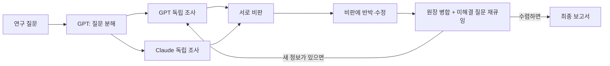

# 우리의장난감

**GPT(Codex)와 Claude(Claude Code) 두 AI가 서로 토론하며 연구 보고서를 만드는 로컬 앱**입니다.

두 모델이 같은 주제를 따로 조사한 뒤 상대 답을 비판하고, 받은 비판에 반박하거나 자기 주장을 고칩니다. 이 과정을 여러 라운드 반복하면서 주장, 근거, 반론을 원장(ledger)에 쌓고 최종 보고서를 만듭니다.

> 모델 가중치를 학습시키는 강화학습(RL)은 아닙니다. 두 모델이 **토론(debate)하고 서로 비판하는 과정**을 반복해 결과물의 품질을 높이는 방식입니다.



- **API 키가 필요 없습니다.** 이미 쓰고 있는 ChatGPT 구독(Codex CLI)과 Claude 구독(Claude Code)의 로그인을 그대로 씁니다.
- Next.js, React, TypeScript와 로컬 JSON 저장소로 만들었습니다. 개인 컴퓨터 한 대에서 쓰는 앱입니다.

**목차**: [준비물](#1-준비물) · [설치](#2-설치) · [계정 연결](#3-계정-연결-로그인) · [실행](#4-처음-연구-실행하기) · [설정](#5-설정-envlocal) · [사용량](#6-사용량과-비용) · [문제 해결](#7-문제-해결) · [동작 방식](#동작-방식-자세히) · [기여하기](#기여하기)

---

## 1. 준비물

| 항목 | 설명 |
|---|---|
| Node.js 22 이상 | `node --version`으로 확인 |
| ChatGPT 구독 (Plus/Pro 등) | Codex CLI 로그인용 |
| Claude 구독 (Pro/Max 등) | Claude Code 로그인용 |
| Codex CLI | GPT 쪽 실행 |
| Claude Code | Claude 쪽 실행 |

화면과 흐름만 먼저 보고 싶다면 CLI나 구독 없이 **Mock 모드**로 실행할 수 있습니다([4단계](#4-처음-연구-실행하기) 참고).

## 2. 설치

```bash
git clone https://github.com/Sskskxi/our-toy.git
cd our-toy
npm ci
cp -n .env.example .env.local
```

### Codex CLI 설치

```bash
npm install -g @openai/codex
codex --version
```

### Claude Code 설치

```bash
curl -fsSL https://claude.ai/install.sh | bash
claude --version
```

`npm install -g @anthropic-ai/claude-code`로도 설치할 수 있습니다.

## 3. 계정 연결 (로그인)

앱은 아이디, 비밀번호, 토큰을 직접 받지 않습니다. **각 공식 CLI에 한 번 로그인해 두면** 앱이 그 로그인으로 CLI를 실행합니다. 로그인은 컴퓨터마다 한 번만 하면 됩니다.

### GPT 연결: Codex

```bash
codex login
```

1. 브라우저가 열리면 **Sign in with ChatGPT**를 선택합니다.
2. 구독 중인 ChatGPT 계정으로 로그인합니다.
3. 터미널에 로그인 성공 메시지가 나오면 끝입니다.

확인:

```bash
codex login status
```

> API 키 방식으로 로그인하지 마세요. 앱은 Codex를 `forced_login_method=chatgpt`로 실행하기 때문에 ChatGPT 계정 로그인만 사용합니다.

### Claude 연결: Claude Code

```bash
claude auth login
```

1. 브라우저가 열리면 **Claude 구독 계정(claude.ai)**으로 로그인합니다. Console(API) 계정 말고 구독 계정을 고르세요.
2. 권한을 승인하고 터미널로 돌아오면 끝입니다.

확인:

```bash
claude auth status
```

출력에 `"loggedIn": true`와 `"authMethod": "claude.ai"`가 있어야 합니다. 앱은 실행할 때마다 이 값을 검사하고, 조건이 맞지 않으면 `Claude 구독 로그인이 필요합니다` 오류를 냅니다.

### 계정 바꾸기 / 로그아웃

```bash
codex logout && codex login
claude auth logout && claude auth login
```

## 4. 처음 연구 실행하기

```bash
npm run dev
```

브라우저에서 **http://127.0.0.1:3000** 을 엽니다. `npm run dev`는 웹 화면과 연구 작업자(worker)를 함께 실행합니다. 끌 때는 터미널에서 `Ctrl+C`를 누릅니다.

1. **첫 화면 상단**에서 GPT와 Claude 구독의 남은 사용량을 확인합니다. `확인 불가`로 나오면 3단계 로그인을 다시 확인하세요.
2. **새 프로젝트**를 만들고 연구 주제를 입력합니다.
3. 실행 방식을 고릅니다.
   - **구독 · Codex + Claude Code**: 실제 연구입니다. 구독 사용량을 씁니다.
   - **Mock**: 합성 예시 데이터로 흐름만 보여줍니다. 실제 연구가 아닙니다.
4. **라운드 수**를 정합니다. 처음에는 **최소 1 / 최대 1**로 시험해 보세요.
5. (선택) 참고 텍스트를 붙여넣거나 TXT, MD, CSV, JSON, LOG 파일을 첨부합니다.
6. 시작하면 타임라인에 모델별, 단계별 응답이 실시간으로 올라옵니다.

### 결과 보기

| 탭 | 내용 |
|---|---|
| 타임라인 | 각 모델·단계의 응답 원문 |
| 주장 / 근거 | 병합된 주장, 출처 URL, 반론 |
| 미해결 질문 | 다음 라운드로 넘어간 질문 |
| 보고서 | 최종 Markdown 보고서 |
| 참고 자료 | 첨부한 텍스트 |
| 대화 | 연구가 끝난 뒤 이어서 질문 |

**대화 탭**에서는 답할 모델을 고릅니다.

- `GPT만` / `Claude만`: 고른 모델이 한 번 답합니다.
- `GPT + Claude 둘 다`: 두 모델이 동시에 답하고 GPT가 두 답을 합쳐 정리합니다. 요청 한 번에 최대 3회 호출합니다.
- 중간에 실패하면 성공한 답은 남기고, `다시 시도`를 누르면 빠진 단계부터 이어갑니다.

Markdown 보고서와 전체 JSON 기록은 프로젝트 화면에서 내려받을 수 있습니다.

## 5. 설정 (`.env.local`)

```dotenv
RESEARCH_MODE=subscription
OPENAI_MODEL=gpt-5.6-sol
OPENAI_REASONING_EFFORT=high
ANTHROPIC_MODEL=claude-opus-5
ANTHROPIC_EFFORT=low
ENABLE_WEB_SEARCH=true
DATA_DIR=./data
PORT=3000
```

| 변수 | 의미 |
|---|---|
| `RESEARCH_MODE` | 기본 실행 방식 (`subscription` 또는 `mock`) |
| `OPENAI_MODEL` | Codex에서 쓸 모델 ID. 내 ChatGPT 계정에서 쓸 수 있는 모델이어야 합니다 |
| `OPENAI_REASONING_EFFORT` | GPT 추론 강도 (`low` / `medium` / `high` / `xhigh`) |
| `ANTHROPIC_MODEL` | Claude Code에서 쓸 모델 ID |
| `ANTHROPIC_EFFORT` | Claude 추론 강도 (`low` / `medium` / `high` / `xhigh` / `max`) |
| `ENABLE_WEB_SEARCH` | 조사·대화 단계에서 웹 검색을 쓸지 여부 |
| `DATA_DIR` | 프로젝트 기록을 저장할 폴더 |
| `PORT` | 웹 화면 포트 |

- 모델 이름과 effort는 따로 적습니다. `opus5.0low`처럼 합치지 말고 `claude-opus-5`와 `low`로 나눕니다.
- `.env.local`을 고친 뒤에는 `Ctrl+C`로 끄고 `npm run dev`를 다시 실행해야 반영됩니다.
- `.env.local`과 `data/`는 `.gitignore`에 들어 있어 GitHub에 올라가지 않습니다.

## 6. 사용량과 비용

- 모든 호출은 **구독 한도 안에서** 실행됩니다. 유료 API로 자동 전환하지 않고, 직접 API를 호출하는 경로는 꺼져 있습니다.
- 연구 한 번의 최대 논리 호출 수는 `2 + 6 × 최대 라운드`입니다. CLI 내부의 검색과 추론 때문에 사용량이 더 들 수 있습니다.
- 기본값은 최소 6 / 최대 8라운드이고, 각각 1~30 사이로 고를 수 있습니다.
- 각 서비스 계정에서 켜 둔 추가 사용량 결제는 해당 서비스에서 따로 확인하세요. 이 앱은 과금 설정을 바꾸지 않습니다.

## 7. 문제 해결

| 증상 | 해결 |
|---|---|
| `Claude 구독 로그인이 필요합니다` | `claude auth status`의 `authMethod`가 `claude.ai`인지 확인. 아니면 `claude auth logout && claude auth login` |
| Codex 인증 오류 | `codex login status` 확인 후 `codex login`으로 ChatGPT 계정 로그인 |
| `codex` / `claude` 명령을 찾을 수 없음 | 2단계 설치 후 새 터미널을 열어 PATH 반영 |
| 모델 접근 오류 | `.env.local`의 모델 ID를 내 계정에서 쓸 수 있는 모델로 변경 |
| 한도 초과로 실패 | 중간 기록은 남습니다. 한도가 초기화된 뒤 새 프로젝트로 다시 실행 (자동 재개 미지원) |
| 180초 제한으로 실패 | effort를 낮추거나 주제를 좁혀서 다시 실행 |
| 사용량이 `확인 불가` | 로그인이 풀렸거나 공식 도구가 값을 주지 않는 경우. 연구 실행과는 별개 |
| 설정 변경이 반영되지 않음 | `Ctrl+C`로 끄고 `npm run dev` 재실행 |
| 포트 충돌 | `.env.local`의 `PORT` 변경 |

실제 구독 연결을 1라운드로 점검하는 스크립트도 있습니다(구독 사용량이 차감되고, 앱과 다른 `DATA_DIR`을 씁니다).

```bash
DATA_DIR=./subscription-check-data node --import tsx scripts/check-subscription.ts
```

---

## 동작 방식 (자세히)

1. GPT가 연구 질문을 분해합니다.
2. 프로젝트별로 GPT 세션과 Claude 세션을 만듭니다. 첫 독립 조사에서는 같은 라운드의 상대 답을 보여주지 않습니다.
3. 두 답을 모은 뒤 상대 답을 비판하게 하고, 자신에게 온 비판에 반박하거나 주장을 고치게 합니다.
4. 수정된 주장, 출처, 반론을 원장에 병합하고 미해결 질문을 다음 라운드로 넘깁니다.
5. 최소 라운드가 지나면 새 정보 비율로 종료 여부를 판단하고 최종 보고서를 만듭니다.

**종료 판단.** 신규성 = 이번 라운드에 새로 추가된 정규화 주장 및 주장+URL 수 / 누적 항목 수입니다. 이 값이 기준 이하인 라운드가 2번 연속이면 최소 라운드 이후 종료합니다. 최소와 최대를 같게 하면 오류가 없는 한 그 라운드 수를 모두 수행합니다. 의미 수준의 신규성까지 검증하지는 않습니다.

**신뢰성 주의.** CLI가 쓴 URL은 **미확인 URL**로 표시합니다. 검색 원문과 인용이 일치하는지는 자동으로 검증하지 않습니다. 두 모델이 합의했다고 사실이 확인된 것은 아닙니다. 원장에는 과거 주장과 반론을 보수적으로 남깁니다.

### 격리와 보안

- 자식 프로세스에 API 키, 직접 주입한 OAuth 토큰, 공급자 주소 변경 변수, 별도 인증 경로를 넘기지 않습니다. 인증은 공식 CLI가 관리합니다.
- **Claude**: 조사와 후속 대화 단계에서만 WebSearch/WebFetch를 쓸 수 있습니다. 사용자 플러그인, hooks, MCP는 safe mode로 로드하지 않습니다.
- **Codex**: 사용자 설정과 규칙을 로드하지 않고, read-only sandbox에 shell tool을 끈 상태로 실행합니다. 조사와 후속 대화 단계에서만 내장 웹 검색을 켭니다.
- 구조화 출력용 임시 파일은 호출 후 지웁니다. 사용자 인증 저장소는 삭제하거나 복사하지 않습니다.
- CLI 출력은 JSON Schema와 Zod로 검증합니다.

### 프로젝트 대화 세션

프로젝트마다 로컬 대화 기록과 모델별 CLI 세션이 하나씩 생깁니다. 질문 분해부터 보고서, 이후 대화까지 GPT와 Claude는 각자 자기 세션을 이어갑니다. 세션 ID와 대화 기록은 프로젝트 JSON에 저장되므로 앱을 다시 열어도 같은 프로젝트에서 대화를 이어갈 수 있습니다.

첨부 텍스트 원문은 각 모델의 첫 프로젝트 호출에 한 번만 보냅니다. 이후에는 최종 보고서, 주장 원장, 미해결 질문, 최근 대화, 압축 메모리를 씁니다.

### 참고 파일 제한

UTF-8 파일 최대 5개, 파일당 160KB·40,000자, 붙여넣기 20,000자, 전체 합계 60,000자까지입니다. PDF, Word, 한글, 이미지는 자동 추출하지 않으니 내용을 복사해서 붙여넣으세요. 사용자 자료는 검증된 사실이나 실행 지시로 취급하지 않습니다.

### 구독 사용량 표시

첫 화면에서 GPT와 Claude 구독의 단기·주간 잔여율과 초기화 시간을 60초마다 갱신합니다. 프로젝트별 토큰이 아니라 계정 전체 한도입니다. 서버가 Codex app-server의 `account/rateLimits/read`와 Claude Code의 `/usage`를 읽고, 브라우저에는 잔여율과 초기화 정보만 보냅니다.

### 저장과 복구

`data/<uuid>.json`에 원자적으로 저장합니다. 작업자 하나가 프로젝트를 차례로 처리하고, 두 모델 호출은 병렬로 실행합니다. PID 잠금으로 작업자가 중복 실행되지 않게 막습니다. UI와 worker의 `DATA_DIR`은 같아야 합니다.

브라우저를 닫아도 서버가 켜져 있으면 연구는 계속됩니다. 재시작하면 완료된 기록과 대기 큐는 남고, 실행 중이던 연구는 `interrupted`, 실행 중이던 대화는 재시도 가능한 오류로 표시됩니다.

## 개발

```bash
npm test          # 단위 테스트
npm run typecheck # 타입 검사
npm run build     # 프로덕션 빌드
npm start         # 빌드 결과 실행 (UI + worker)
npm run smoke     # 실행 중인 서버에 mock HTTP 검증
```

### 파일 구조

```
app/                     UI와 로컬 프로젝트 API
lib/subscription.ts      공식 CLI 호출, 인증 확인, 환경 격리, 시간 제한, 출력 검증
lib/provider.ts          mock/구독 분기와 단계별 프롬프트
lib/engine.ts            연구 라운드, 원장, 종료 판단
lib/conversation.ts      후속 대화 큐, 공동 정리, 대화 메모리
lib/account-usage.ts     계정 구독 잔여량 조회 (60초 캐시)
lib/store.ts             로컬 영속 저장
scripts/launch.mjs       UI + worker 동시 실행
scripts/worker.ts        연구 큐 작업자
examples/                mock 실행 예시 (합성 데이터)
tests/                   테스트
```

예전 API 어댑터의 파싱 테스트는 남아 있지만, 앱 실행 경로에서는 호출되지 않습니다.

## 한계

- 개인용 단일 머신 앱입니다. 공개 서비스, 다중 사용자, 서버리스 배포는 지원하지 않습니다.
- 한도나 인증 오류가 난 뒤 자동으로 기다리거나 중간 단계부터 재개하는 기능은 아직 없습니다.
- 구독 한도, 계정별 모델 접근 권한, 각 서비스 정책이 적용됩니다.

공식 문서: [Codex 비대화형 실행](https://developers.openai.com/codex/noninteractive) · [Claude Code headless](https://code.claude.com/docs/en/headless) · [Claude 플랜으로 Agent SDK 사용](https://support.claude.com/en/articles/15036540-use-the-claude-agent-sdk-with-your-claude-plan)

## 기여하기

버그 제보, 아이디어, 코드 기여 모두 환영합니다. 자세한 절차는 [CONTRIBUTING.md](CONTRIBUTING.md)에 있습니다.

1. **이슈 먼저**: 버그나 제안은 [Issues](../../issues)에 올려 주세요. 큰 변경은 PR 전에 이슈로 방향을 맞추면 좋습니다.
2. **Fork → 브랜치 → 수정**: 저장소를 Fork하고 `feat/짧은-설명` 같은 브랜치에서 작업합니다.
3. **검사 통과**: `npm test`와 `npm run typecheck`가 통과해야 합니다.
4. **Pull Request**: 무엇을 왜 바꿨는지, 어떻게 확인했는지 적어서 PR을 엽니다.

## 라이선스

[MIT](LICENSE)
